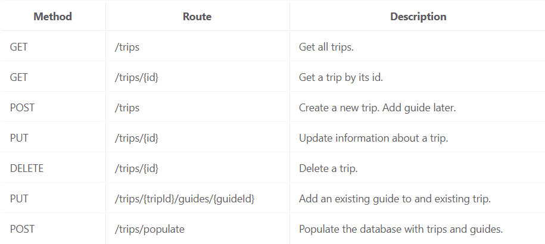

# Trip Planning application

Dette projekt er et backend system for an e-commerce platform offering trip planning services. Tasks include managing trips and guides

## Teknologier
- Java
- Javalin
- Maven
- Lombok
- JDK

## Database 
Jeg har kaldt databasen for trips, så hvis det ikke er på jeres lokale maskine, virker det ikke :)
## OBS
Altid kør main før noget virker, da vi skal connecte til 7070 localhost før det virker.
Og altid tjek at persistence filen virker.
## Tests
Jeg lavede nogen guideDAOTest og hibernate test og tripdaotest, tidligt, som virkede, men efter senere, skulle klasserne ændres, så de virker ikke mere :)
## Endpoints

# Trip API Documentation

## Endpoint Tests

### Populate Database
http
POST http://localhost:7070/trips/populate
Response (200 OK):
{
"message": "Database populated successfully"
}

### Get All Trips

http
GET http://localhost:7070/trips
Response (200 OK):
[
{
"id": 2,
"name": "Lake Experience",
"tripCategory": "LAKE",
"startTime": [2024, 11, 6, 12, 17, 45, 310354000],
"endTime": [2024, 11, 6, 18, 17, 45, 310354000],
"latitude": 55.7761,
"longitude": 12.6683,
"price": 399.99,
"guide": {
"id": 1,
"firstName": "John",
"lastName": "Doe",
"email": "john@example.com",
"phone": "12345678",
"yearsOfExperience": 5
}
},
{
"id": 3,
"name": "City Tour",
"tripCategory": "CITY",
"startTime": [2024, 11, 7, 12, 17, 45, 310354000],
"endTime": [2024, 11, 7, 15, 17, 45, 310354000],
"latitude": 55.6761,
"longitude": 12.5683,
"price": 199.99,
"guide": {
"id": 2,
"firstName": "Jane",
"lastName": "Smith",
"email": "jane@example.com",
"phone": "87654321",
"yearsOfExperience": 3
}
},
{
"id": 4,
"name": "Beach Adventure",
"tripCategory": "BEACH",
"startTime": [2024, 11, 5, 12, 18, 42, 407218000],
"endTime": [2024, 11, 5, 16, 18, 42, 407218000],
"latitude": 55.6761,
"longitude": 12.5683,
"price": 299.99,
"guide": {
"id": 3,
"firstName": "John",
"lastName": "Doe",
"email": "john@example.com",
"phone": "12345678",
"yearsOfExperience": 5
}
},
{
"id": 5,
"name": "Lake Experience",
"tripCategory": "LAKE",
"startTime": [2024, 11, 6, 12, 18, 42, 407218000],
"endTime": [2024, 11, 6, 18, 18, 42, 407218000],
"latitude": 55.7761,
"longitude": 12.6683,
"price": 399.99,
"guide": {
"id": 3,
"firstName": "John",
"lastName": "Doe",
"email": "john@example.com",
"phone": "12345678",
"yearsOfExperience": 5
}
},
{
"id": 6,
"name": "City Tour",
"tripCategory": "CITY",
"startTime": [2024, 11, 7, 12, 18, 42, 407218000],
"endTime": [2024, 11, 7, 15, 18, 42, 407218000],
"latitude": 55.6761,
"longitude": 12.5683,
"price": 199.99,
"guide": {
"id": 4,
"firstName": "Jane",
"lastName": "Smith",
"email": "jane@example.com",
"phone": "87654321",
"yearsOfExperience": 3
}
}

### Get Trip By ID
http
GET http://localhost:7070/trips/1
Response (200 OK):
{
"id": 2,
"name": "Lake Experience",
"tripCategory": "LAKE",
"startTime": [2024, 11, 6, 12, 17, 45, 310354000],
"endTime": [2024, 11, 6, 18, 17, 45, 310354000],
"latitude": 55.7761,
"longitude": 12.6683,
"price": 399.99,
"guide": {
"id": 1,
"firstName": "John",
"lastName": "Doe",
"email": "john@example.com",
"phone": "12345678",
"yearsOfExperience": 5
}
}

### Create New Trip

http
POST http://localhost:7070/trips
Content-Type: application/json
{
"name": "Copenhagen City Walk",
"tripCategory": "CITY",
"startTime": "2024-04-01T10:00:00",
"endTime": "2024-04-01T12:00:00",
"latitude": 55.6761,
"longitude": 12.5683,
"price": 299.99
}
Response (201 Created):
{
"id": 4,
"name": "Copenhagen City Walk",
"tripCategory": "CITY",
"startTime": "2024-04-01T10:00:00",
"endTime": "2024-04-01T12:00:00",
"latitude": 55.6761,
"longitude": 12.5683,
"price": 299.99
}

### Update Trip

http
PUT http://localhost:7070/trips/4
Content-Type: application/json
{
"id": 4,
"name": "Updated Copenhagen City Walk",
"tripCategory": "CITY",
"startTime": "2024-04-01T10:00:00",
"endTime": "2024-04-01T12:00:00",
"latitude": 55.6761,
"longitude": 12.5683,
"price": 349.99
}
Response (200 OK):
{
"id": 4,
"name": "Updated Copenhagen City Walk",
"tripCategory": "CITY",
"startTime": "2024-04-01T10:00:00",
"endTime": "2024-04-01T12:00:00",
"latitude": 55.6761,
"longitude": 12.5683,
"price": 349.99
}

### Add Guide to Trip

http
PUT http://localhost:7070/trips/4/guides/1
Response (200 OK):
{
"message": "Guide added to trip successfully"
}

### Delete Trip

http
DELETE http://localhost:7070/trips/4
Response (204 No Content)

## Guide Information in Response
Når man henter en tur via ID (GET /trips/{id}), inkluderes guide-informationen automatisk i responsen hvis turen har en tilknyttet guide. Dette gøres gennem DTOMapper klassen, som konverterer både trip og guide entiteter til deres respektive DTOer.

## Teoretisk Spørgsmål: PUT vs POST for Guide Assignment

## Hvorfor bruger vi PUT i stedet for POST til at tilføje en guide til en tur?

Vi bruger PUT fordi:

1. Vi opdaterer en eksisterende tur ved at tilføje en guide - vi opretter ikke en ny ressource
2. Det giver mening at bruge PUT da vi kender både trip-id og guide-id på forhånd
3. Samme handling kan gentages uden at skabe duplikater (idempotent)
4. Det følger REST's best practices, hvor PUT bruges til opdateringer og POST til nye ressourcer

## Error Handling

API'et returnerer følgende fejl som JSON responses:

### 404 Not Found
Returneres når en ressource ikke findes.

Eksempel (GET /trips/666):
{
"message": "Trip not found",
"details": "No trip with id: 666"
}

## API Test Results

### 1. Populate Database
Request:

http
POST http://localhost:7070/trips/populate
Response (200 OK):

json
{
"message": "Database populated successfully"
}

### 2. Get Trips by Category
Request:http
GET http://localhost:7070/trips/category/BEACH

json
[
{
"id": 1,
"name": "Beach Adventure",
"tripCategory": "BEACH",
"startTime": "2024-03-06T12:00:00",
"endTime": "2024-03-06T16:00:00",
"latitude": 55.6761,
"longitude": 12.5683,
"price": 299.99,
"guide": {
"id": 1,
"firstName": "John",
"lastName": "Doe",
"email": "john@example.com",
"phone": "12345678",
"yearsOfExperience": 5
}
}
]

### 3. Get Guide Total Price Overview
Request: http
GET http://localhost:7070/trips/guides/totalprice

json
[
{
"guideId": 1,
"totalPrice": 699.98
},
{
"guideId": 2,
"totalPrice": 199.99
}
]

### 4. Invalid Category Test
Request: http
GET http://localhost:7070/trips/category/INVALID

json
{
"message": "Invalid category",
"details": "Valid categories are: [BEACH, CITY, LAKE]"
}

Dette viser:
1. Succesfuld population af databasen
2. Filtrering af trips efter kategori
3. Total pris oversigt per guide
4. Fejlhåndtering ved ugyldig kategori
så det jo dejligt :)

